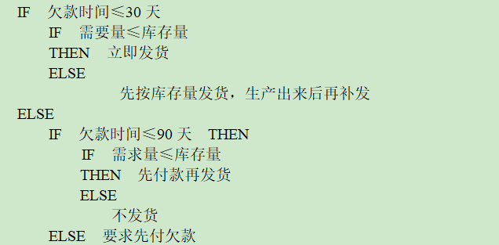
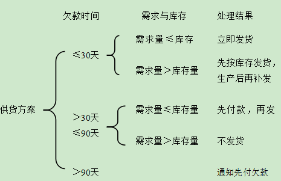

# 结构化方法

> 结构化方法作为一种“思想”工具，可以用于定义需求，建立待建系统的功能模型；可以用于定义满足需求的结构，给出一种特定的软件解决方案。

## 结构化需求分析

+  ### 需求工作中的三大挑战

  1. 问题空间理解

     > 开发人员不甚了解用户业务及应用。

  2. 人与人之间的通信

     > 具有不同知识、技能的的各种人员相互之间的沟通。

  3. 需求的变化性

     > 多方面的原因使得软件需求处于不断的变化之中。

+ ### 需求技术的基本特征

  1. 提供方便的通信机制，例如在不同开发阶段，使用对相关人员易于理解的语言。
  2. 鼓励需求分析人员使用问题空间的术语去思考问题，编写文档。
  3. 提供定义系统边界的方法。
  4. 提供支持抽象的基本机制，例如，“划分” “抽象功能” “结构抽象” 等。
  5. 为需求分析人员提供多种可供选择的方案。
  6. 提供特定的技术，适应需求的变化等。
  
+  ### 需求分析中的基本术语

   1. 数据

      > 客观事物的一种表示

   2. 信息

      > 具有特定语义的数据

   3. 数据流

      > 数据的流动

   4. 加工

      > 数据变换单元

   5. 数据存储

   6. 数据源

      > 数据的来源

   7. 数据潭

      > 数据的目的地

+ ### 系统功能模型表示方法

   #### 数据流图（DFD）

   > 一种表示数据变换的图形化工具

   - 数据流图的元素

     > 数据源/数据潭，数据流，数据加工，数据存储。

   - 图例

     

   - 建模步骤一：建立系统环境图，确定系统语境

     > ​		经过需求发现工作之后，按照系统工程的观点，分析人员一般可以比较容易地确定系统的数据源和数据潭，以及和这些数据源和数据潭相关的数据流，形成系统顶层数据流图，也称为系统环境图。其中，对于最顶层的“大加工”，其表示一般采用待建系统的名字。

   - 建模步骤二：自顶向下，逐步求精，建立系统的层次数据流图

     > ​		在顶层数据流图的基础上，按功能分解的设计思想，进行“自顶向下，逐步求精”，即对加工进行分解，自顶向上地画出各层数据流图，直到底层的加工足够简单，功能清晰易懂，不必再继续分解位置，并把这样的加工成为叶加工。
     
   - 建模步骤三：定义数据字典

     > ​		该步的目标为依据系统的数据流图，定义其中包含的所有数据流和数据存储的数据结构，直到给出构成以上数据的各数据项的基本数据类型。

   - 建模步骤四：描述加工

     > ​		该步的目标为依据系统的数据流图，给出其中每一加工的小说明。由于需求分析的目的是定义问题，因此对DFD图中的每一加工只需给出加工的输入数据和输出数据之间的关系。即从外部来审视一个加工的逻辑。

   - 附：描述加工的三种方式

     1. 结构化自然语言：

        > 如果一个加工的输入数据和输出数据之间的逻辑关系比较简单，可以使用结构化自然语言予以表述。

        ​							

        
     
     2. 判定表：
     
        > 判定表是用以描述的加工的一种工具，通常用来描述一些不易用自然语言表达清楚或需要很大篇幅才能表达清楚的加工。
         <table log-set-param="table_view" class="table-view log-set-param">
            <tbody>
               <tr>
                  <td  height="0" align="left" valign="middle" colspan="2"></td>
                  <td  align="left" valign="middle">
                     
1

                  </td>
                  <td  align="left" valign="middle">
                     
2

                  </td>
                  <td  align="left" valign="middle">
                     
3

                  </td>
                  <td  height="0" align="left" valign="middle">
                     
4

                  </td>
               </tr>
               <tr>
                  <td  height="0" align="left" valign="middle" rowspan="2">
                     
条件

                  </td>
                  <td  align="left" valign="middle">
                     
觉得疲倦？

                  </td>
                  <td  align="left" valign="middle">
                     
Y

                  </td>
                  <td  align="left" valign="middle">
                     
Y

                  </td>
                  <td  align="left" valign="middle">
                     
N

                  </td>
                  <td  align="left" valign="middle">
                     
N

                  </td>
               </tr>
               <tr>
                  <td  align="left" valign="middle">
                     
感兴趣吗？

                  </td>
                  <td  align="left" valign="middle">
                     
N

                  </td>
                  <td  align="left" valign="middle">
                     
Y

                  </td>
                  <td  align="left" valign="middle">
                     
Y

                  </td>
                  <td  align="left" valign="middle">
                     
N

                  </td>
               </tr>
               <tr>
                  <td  height="0" align="left" valign="middle" rowspan="4">
                     
动作

                  </td>
                  <td  align="left" valign="middle">
                     
重读

                  </td>
                  <td  align="left" valign="middle"></td>
                  <td  align="left" valign="middle"></td>
                  <td  align="left" valign="middle"></td>
                  <td  align="left" valign="middle"></td>
               </tr>
               <tr>
                  <td  align="left" valign="middle">
                     
继续

                  </td>
                  <td  align="left" valign="middle"></td>
                  <td  align="left" valign="middle"></td>
                  <td  align="left" valign="middle">
                     
√

                  </td>
                  <td  align="left" valign="middle"></td>
               </tr>
               <tr>
                  <td  align="left" valign="middle">
                     
跳下一章

                  </td>
                  <td  align="left" valign="middle"></td>
                  <td  align="left" valign="middle"></td>
                  <td  align="left" valign="middle"></td>
                  <td  align="left" valign="middle">
                     
√

                  </td>
               </tr>
               <tr>
                  <td  align="left" valign="middle">
                     
休息

                  </td>
                  <td  align="left" valign="middle">
                     
√

                  </td>
                  <td  align="left" valign="middle">
                     
√

                  </td>
                  <td  align="left" valign="middle"></td>
                  <td  align="left" valign="middle"></td>
               </tr>
            </tbody>
         </table>
        
        
     3. 判定树：
     
        > 判定树（Decision Tree），也称为决策树，是用来描述一组不同的条件下，决策的行动是根据不同条件机器取值来选择的处理过程。业务规则的描述通常可以使用判定树这一过程描述工具。
     
        
     
   - 应用中注意的问题
   
  > 在实际应用中，必须按照数据流图中所有图形元素的用法正确使用。
   
  1. 模型平衡问题
        - DFD图与数据字典一致。
        - 底层加工的处理逻辑描述，与数据字典一致。
     2. 信息的复杂性控制问题
        - 上层数据流可以打包。
        - 下层模块的个数：7±2个。
        - 每个加工的数据流不能太多，必要时增加层数。
   
+  ### 需求验证

   > ​		需求阶段的主要任务是完整的定义问题，确定系统的功能与能力。为此该阶段主要任务一般包括需求发现、需求分析和需求验证，最终形成系统的软件需求规格说明书。

   #### 发现错误的方法

   1. 审查
   2. 单元测试
   3. 评估
   4. 集成
   5. 其他

## 结构化设计

> 结构化设计的主要任务是在需求分析的基础上，定义满足需求所需要的结构，及针对给定的问题，给出该问题的软件解决方案，确定”怎么做“的问题。

+ ### 总体设计

  > 总体设计阶段的基本任务是把系统的功能需求分配大一个特定的软件体系结构中

  #### 相关概念

  1. 模块

     > 即软件中具有特定表示的独立成分。

  2. 模块调用

     >即指模块指点的一种使用关系。